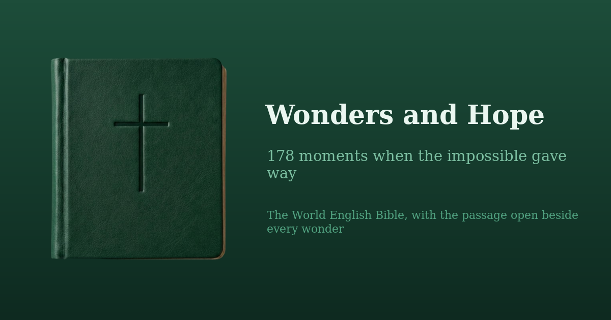

[](https://github.com/raimonvibe/bible-wonders)

# Wonders and Hope

A reading of the Bible's miracles, with the passage open beside you.

The whole Bible is here to read — 66 books, 1,189 chapters of the World English
Bible. Alongside it sits a catalog of **178 wonders**: every divine miracle
involving people, each with a short written card and a link straight into the
chapter it happened in, with its verses highlighted.

Built on [raimonvibe/bible-old-and-new-testament](https://github.com/raimonvibe/bible-old-and-new-testament).

## What it does

- **178 wonders, all written.** Each card has a verbatim pull quote, a few
  notable details, a plain-language account of what happened, what it says
  about hope, and a question to sit with.
- **Read the passage, not just about it.** Opening a wonder opens its chapter
  in the reader and highlights the verses.
- **Gospel accounts are kept separate.** When Matthew, Mark, Luke and John tell
  the same event, each is its own card, linked by "Also in Matthew · Luke", and
  each says what *its* writer stresses that the others do not.
- **Four ways in.** Start Here (25 best-known), by theme, by book or era, or
  the full catalog — with a Bible-order ↔ best-known sort and search.
- **A guided tour.** Fourteen wonders walked in order, with optional narration.
- **Read aloud.** Browser speech, with a Tour / Passage / Both switcher.
- **Two dark themes.** Green for the Old Testament, blue for the New; the
  toggle switches the whole app between them.

## Getting started

Requires **Node 20.9+** (Next 16 will not run on Node 18).

```bash
npm install
npm run dev
```

Then open [http://localhost:3000](http://localhost:3000).

## Working on the catalog

The wonders live in `lib/wonders/`, and the rule is that nothing about a
passage is written from memory.

```bash
# print the shipped WEB text for a reference — copy quotes from this
node scripts/show-passage.js "Exodus 14:21-31"

# merge a batch of card prose into the catalog
node scripts/add-cards.js batches/kingdoms-1.json

# the gate: run this before committing any card change
npm run validate:wonders
```

`validate:wonders` checks that every wonder's book, chapter and verse range
exist in the shipped text; that every pull quote appears **verbatim** in the
verses its reference names; that written cards are complete; and that every
parallel Gospel account carries its `distinctive`. It caught 20 misquotes while
the cards were being written — including a quote taken from Matthew's wording
for a verse in Luke, and a correct quote pointing at the wrong reference.

Two quirks of the WEB data are worth knowing before you edit a quote:

1. **The first word of every verse is capitalised.** A quote spanning a verse
   boundary picks up a stray capital mid-sentence and will never match. Quote
   one complete verse, or widen the reference (`Acts 5:19-20`).
2. **Curly quotes and apostrophes** are used throughout. The validator
   normalises them, so either form matches.

## Project structure

```
app/
  api/bible-data/route.ts     the full text, served to the client
  globals.css                 themes, the 50/50 dock, container-query grids
components/
  BibleApp.tsx                the reader shell
  GuidedTour.tsx              the docked panel: overview, browse, tour
  CatalogBrowser.tsx          reading paths, filters, sort, search
  WonderCardBody.tsx          one card renderer, shared by tour and browser
lib/
  wonders/
    types.ts                  the Wonder type and its tags
    oldTestament.ts           87 wonders
    newTestament.ts           91 wonders
    catalog.ts                the joined catalog and its lookups
    paths.ts                  reading paths, sort, search, resume
  passages.ts                 PassageRef and how references are built
scripts/
  show-passage.js             print WEB text for a reference
  add-cards.js                merge a batch of card prose
  validate-wonders.js         the correctness gate
batches/                      the card prose, as written, batch by batch
data/                         the World English Bible text
```

## How the layout works

- **≥ 960px** is a true 50/50 split: Bible left, panel docked full height on
  the right, each side scrolling on its own.
- **Below that** the panel becomes a bottom sheet over a full-width Bible.
- The breakpoint lives in two places — `SPLIT_MIN_WIDTH` in `GuidedTour.tsx`
  and the `960px` media queries in `globals.css`. **Move both together.**
- Book and chapter grids use **container queries**, so they size against the
  pane they are in rather than the window.

A note on the theme: `darkMode` is set to the selector `html.theme-ocean`, so
**`dark:` means "the blue theme"**, not "dark mode". Both themes are dark.
Write pairs like `text-pine-100 dark:text-ocean-100`.

## Technology

Next.js 16 (App Router), TypeScript, Tailwind CSS 3.4, Lucide icons.

## Text and licence

Scripture is the **World English Bible**, which is in the public domain.
The application code is MIT licensed.
